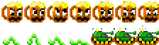

## ImageMagick Visual Reference

 

Example sprite sheet  
  
To extract the sprites, use tile cropping  
\$ `convert bobs.gif -crop 32x32 +repage d%03d.gif`

Results  

---

To crop horizontal strips form a sprite sheet  
\$ `convert bobs.gif -crop 0x32 +repage b%02d.gif`  
  

For vertical strips just swap the dimensions.

Notice indexing starts 00, 01... but what if I want it to start with 01? Use null: padding  
\$ `convert null: b00.gif -crop 32x0 +repage f%02d.gif`  
   
^ f01.gif ^ f02.gif

---

Example row of sprites  

I can crop the sprites if I know their dimensions. In this case 32 pixels wide  
\$ `convert dude-cropped.png -crop 32x0 +repage d%02d.png`  

---

Example image  

Crop 10 pixels from the top  
\$ `convert in.gif -crop +0+10 +repage ftop.gif`  
  
Crop 10 pixels from the left  
\$ `convert in.gif -crop +10+0 +repage fleft.gif`  
  
Crop 10 pixels from the right  
\$ `convert in.gif -crop -10+0 +repage fright.gif`  
  
Crop 10px from the bottom  
\$ `convert in.gif -crop +0-10 +repage fbtm.gif`  

---

The origin (0,0) is in the upper-left corner.  
Dimensions and offset take this syntax: (w)x(h)(+right)(+down).  
The "-negate" option negatively colours an area.

Negate an area, topL corner, 10px to the right, 20px down  
\$ `magick rose: -region '100x200+10+20' -negate rNeg1.gif`  

Area spills off the left edge  
\$ `magick rose: -region '100x200-10+20' -negate rNeg2.gif`  

Set the origin (0,0) to the centre. Negate an area below and left of the origin  
\$ `magick rose: -gravity center -region '100x200-10+20' -negate rNeg3.gif`  

Negate an area centre  
\$ `magick rose: -gravity center -region '100x200' -negate rNeg4.gif`  

---

Example images  
,  , 

<!-- CHANGE bad-cropped blank TV! -->

Append the images in a row  
\$ `magick d009.gif d010.gif d011.gif +append tv1.gif`  

Append the images in a stack  
\$ `magick d1.gif d2.gif d3.gif -append tv1.gif`  

If the filenames follow a consistent number pattern then a Bash range can select several files  
\$ `magick d%03d.gif[9-11] +append tv1.gif`

---

Generate a gif with several input images and one output image. A Bash range can help  
\$ `magick d00%d.gif[0-7] bl.gif`

---

Generate a builtin image  
\$ `magick rose: rose.gif`

---

Convert png to gif  
\$ `convert dude.png +repage dude.gif`

---

Scale with -scale. Use a whole fraction to avoid blur  
Blow up double size  
\$ `convert in.gif -scale 200% out.gif`  
Shrink half size  
\$ `convert in.gif -scale 50% out.gif`

---

To add a 1px white border to the left side (sptsheets) do  
\$ `convert null: v01.png +append a3.png`

---

Rotate  
\$ `convert in.jpg -rotate 90 out.jpg`  
\$ `convert in.jpg -rotate -90 out.jpg`

---

Tips:  
Convert a PNG to GIF before cropping to see the whitespace that PNGs hide.  
Pad the output to 3 digits with `%03d`. Under 100 results images should be enough.
