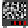
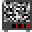

## ImageMagickVisRef

### A visual reference

---

Generate a builtin image  
\$ `magick rose: rose.gif`

---

convert png to gif to remove whitespace  
\$ `convert dude.png +repage dude.gif`

---

Scale
Avoid blur with -scale and a whole fraction %  
Double blow up:  
\$ `convert in.gif -scale 200% out.gif`  
Half shrink:  
\$ `convert in.gif -scale 50% out.gif`

---

To crop a sprite sheet  
  
do this  
\$ `convert bobs.gif -crop 32x32 +repage d%03d.gif`

Produces  

---

Rows  
Crop horizontal strips  
\$ `convert bobs.gif -crop 0x32 +repage b%02d.gif`  
  

And just swap the dimensions for vertical. Notice indexing starts 00, 01... but what if I want pics to start on 01? Use "null:" padding  
\$ `convert null: b00.gif -crop 32x0 +repage f%02d.gif`  
 

Crop 10px from the top  
\$ `convert in.gif -crop +0+10 +repage ftop.gif`  
  
Crop 10px from the left  
\$ `convert in.gif -crop +10+0 +repage fleft.gif`  
  
Crop 10px from the right  
\$ `convert in.gif -crop -10+0 +repage fright.gif`  
  
Crop 10px from the bottom  
\$ `convert in.gif -crop +0-10 +repage fbtm.gif`  

---

 

Here's the dude. I want frames.  

In this case I know dude is 32px wide

\$ `convert dude-cropped.png -crop 32x0 +repage d%02d.png`

---

source sprites
    
append in a row  
\$ `magick d009.gif d010.gif d011.gif +append tv1.gif`

append in a stack  
\$ `magick d1.gif d2.gif d3.gif -append tv1.gif`

Can also do above based on filename number!

\$ `magick d%03d.gif[9-11] +append tv1.gif`

---

For offset, the origin (0,0) is upper-left corner. (w)x(h)(+right)(+down)  
The following negatively colours a (tall) area:  
First in topL corner 10px to the right, 20px down. turned a red rose blue  
\$ `magick rose: -region '100x200+10+20' -negate rNeg1.gif`

This spills off the left edge  
\$ `magick rose: -region '100x200-10+20' -negate rNeg2.gif`

This resets the origin (0,0) to the centre so offset is below+L of it.  
\$ `magick rose: -gravity center -region '100x200-10+20' -negate rNeg3.gif`

dead centre  
\$ `magick rose: -gravity center -region '100x200' -negate rNeg4.gif`

---

Make a gif

\$ `magick d00%d.gif[0-7] bl.gif`

 

---

Tips:  
Convert to gif before cropping to see the whitespace that pngs hide.  
Output %03d cos it probably generates 100s of sprites.
I probably do want to keep the rows anyway!
