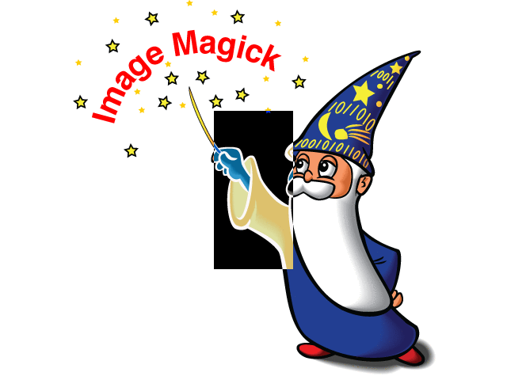

## ImageMagickVisRef

### A visual reference

---

Generate a builtin image
>`magick rose: rose.gif`

  

---

convert png to gif (to see whitespace better)
> `convert dude.png dude.gif`  

---

To crop a sprite sheet  
  
do this
> `convert bobs.gif -crop 32x32 +repage d%03d.gif`

Produces  

---

Rows

---

 

Here's the dude. I want frames.  
  

In this case I know dude is 32px wide

> `convert ~/dude-cropped.png -crop 32x0 +repage ~/d%02d.png`

---
source sprites
    
append in a row
>`magick d1.gif d2.gif d3.gif +append tv1.gif`

append in a stack  
>`magick d1.gif d2.gif d3.gif -append tv1.gif`

---

For offset, the origin (0,0) is upper-left corner. (w)x(h)(+right)(+down)
The following negatively colours a (tall) area
First in topL corner 10px to the right, 20px down. turned a yellow star blue
>`magick logo: -region '100x200+10+20' -negate wizNeg1.png`

This spills off the L edge
>`magick logo: -region '100x200-10+20' -negate wizNeg2.png`

This resets the origin (0,0) to the centre so offset is below+L of it.
>`magick logo: -gravity center -region '100x200-10+20' -negate wizNeg3.png`

dead centre
>`magick logo: -gravity center -region '100x200' -negate wizNeg4.png`

---

source  
Make a gif

> `magick d00%d.gif[0-7] bl.gif`

 

---

Tips:  
Convert to gif before cropping to see the whitespace that pngs hide.  
Output %03d cos it probably generates 100s of sprites.
I probably do want to keep the rows anyway!

