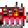
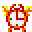

## ImageMagick Visual Reference

 

Example sprite sheet with consistent sprite sizes and no spacing or margins  
  
To extract the sprites, use tile cropping  
`convert bobs.gif -crop 32x32 +repage d%03d.gif`

Results  
     

---

To crop horizontal strips from a sprite sheet  
`convert bobs.gif -crop 0x32 +repage b%02d.gif`  
  
For vertical strips just swap the dimensions.

Automatic filename numbering is done with `%02d` which means two digit numbers padded with zeroes, starting at 00. But what if we want it to start at 01? Use `null:`  
`convert null: b00.gif -crop 32x0 +repage f%02d.gif`  
   
^ f01.gif ^ f02.gif

---

Example row of sprites  

I can crop the sprites if I know their dimensions. In this case 32 pixels wide  
`convert dude-cropped.png -crop 32x0 +repage d%02d.png`  

---

Example image  

Crop 10 pixels from the top  
`convert in.gif -crop +0+10 +repage ftop.gif`  
  
Crop 10 pixels from the right  
`convert in.gif -crop -10+0 +repage fright.gif`  
  

Crop can also extract an area of the image if you include an offset  
`convert in.gif -crop 50x10+10+20 +repage out.gif`  
  

By the way, `+repage` readjusts the canvas to match the final image size after cropping. Without it, the original canvas remains with transparent background  
`convert in.gif -crop 50x10+10+20 out.gif`  
  

---

Example images  
 , , 

Append the images in a row  
`magick tvfuzz1.gif tvfuzz2.gif tvtest.gif +append tv1.gif`  

Append the images in a stack  
`magick tvfuzz1.gif tvfuzz2.gif tvtest.gif -append tv2.gif`  

If the filenames follow a consistent number pattern then a Bash range can select several files  
`magick d%03d.gif[9-11] +append tv1.gif`

---

To generate an animated gif, use several input images and one output image. A Bash range can help  
`magick d00%d.gif[0-7] bl.gif`  

---

Built in images:  
xc: - Block colour. State the size  
logo: - 640x480 ImageMagick Logo  
wizard: - 480x640 ImageMagick mascot  
rose: - 70x46 rose  
null: - 1x1 transparent pixel

Generate a builtin image  
`magick rose: rose.gif`  

Generate a black box  
`convert -size 100x100 xc:black black.gif`  

---

Convert a png to gif  
`convert dude.png +repage dude.gif`

Convert all files in the current folder  
`convert * +repage %03d.gif`

---

Scale with `-scale`. Use a whole fraction to avoid blur.  
Blow up double size  
`convert in.gif -scale 200% out.gif`  
Shrink half size  
`convert in.gif -scale 50% out.gif`

---

To add a 1px white border to the left side (spritesheets)  
`convert null: v01.png +append a3.png`

---

Rotate  
`convert in.jpg -rotate 90 out.jpg`  
`convert in.jpg -rotate -90 out.jpg`

---

The origin (0,0) is in the upper-left corner.  
Dimensions and offset take this syntax: (w)x(h)(+right)(+down).  
The "-negate" option negatively colours an area.

Negate an area, topL corner, 10px to the right, 20px down  
`magick rose: -region '100x200+10+20' -negate rNeg1.gif`  

Area spills off the left edge  
`magick rose: -region '100x200-10+20' -negate rNeg2.gif`  

Set the origin (0,0) to the centre. Negate an area below and left of the origin  
`magick rose: -gravity center -region '100x200-10+20' -negate rNeg3.gif`  

Negate an area centre  
`magick rose: -gravity center -region '100x200' -negate rNeg4.gif`  

---

Tips:  
Convert a PNG to GIF before cropping to see the whitespace that PNGs hide.  
Pad the output to 3 digits with `%03d`, up to 999. Pad more if more than 10 by 10 tiles in a sheet.  
Remember Bash tricks when selecting input images, globs, wildcards, ranges, expansions.
